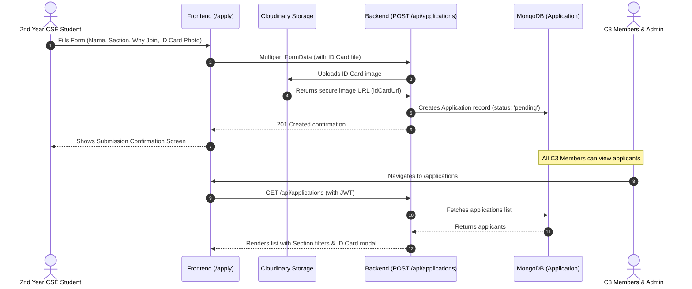
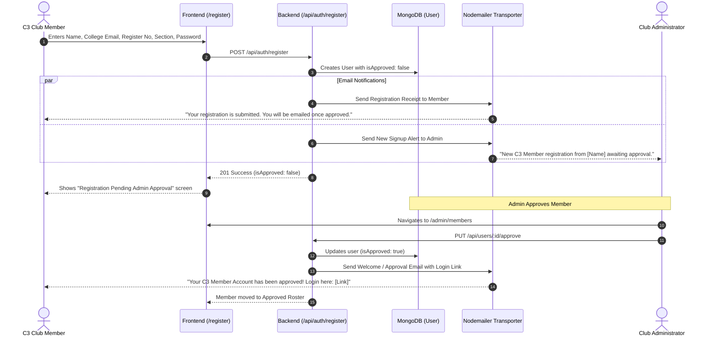
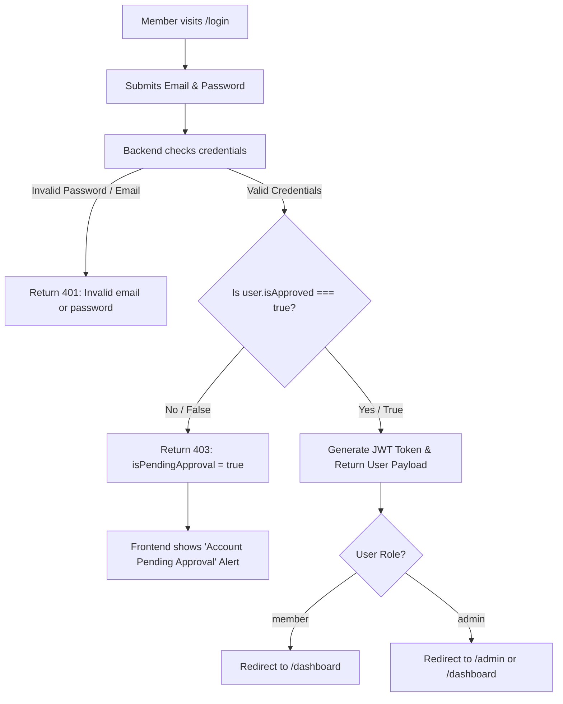
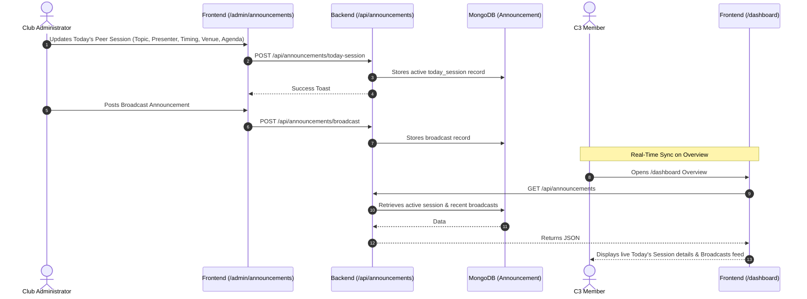

# Campus to Corporate Club (C3) - System Architecture & Workflows Guide

This document explains the complete end-to-end functionality of the C3 Platform, including the **Junior Hiring Workflow**, **Member Registration & Admin Approval Workflow**, **Authentication & Access Control**, and the **Live Session Announcement System**.

---

## 1. Junior Hiring & Recruitment Workflow (`/apply`)

The recruitment process is tailored specifically for **2nd-year CSE students (Section A & Section B)**.

### Steps in Detail:
1. **Public Recruitment Page (`/apply`)**:
   - The junior candidate fills in **Full Name**, **Section** (`CSE A` / `CSE B`), **Why do you want to join C3?**, and attaches their **College ID Card Photo**.
   - No login or member account creation is required for junior applicants.
2. **File Processing & Cloud Storage**:
   - The backend uses `multer-storage-cloudinary` via `resumeUpload.js` to upload the ID card to the Cloudinary folder `c3-applications`.
3. **Database Record**:
   - Saved in the `Application` collection with status set to `pending`.
4. **Shared Member Access (`/applications`)**:
   - **All authenticated C3 members** have read access to view submissions, filter by section (`CSE A` / `CSE B`), search by candidate name, and inspect high-resolution student ID cards in a modal preview.
   - **Admins** have additional controls to update applicant statuses (`pending`, `shortlisted`, `accepted`, `rejected`).

---

## 2. C3 Member Registration & Admin Approval (`/register`)

Member registration is strictly for C3 club members and includes an automated email workflow powered by **Nodemailer**.

### Steps in Detail:
1. **Signup Submission (`/register`)**:
   - The member provides their details and sets their password.
   - Account is created in MongoDB with `role: 'member'` and `isApproved: false`.
2. **Automated Registration Emails**:
   - **To the Member**: Informs them that their account is under review and they will be emailed once approved.
   - **To the Admin**: Alerts the admin that a new member registered with their Name, Email, Register Number, and Section.
3. **Admin Member Portal (`/admin/members`)**:
   - Two tabs: **Pending Approvals** and **Approved Roster**.
   - Admin clicks **Approve** on a pending member.
4. **Approval Email Dispatch**:
   - Nodemailer dispatches an official welcome email containing the direct login URL.

---

## 3. Login & Authentication Flow (`/login`)

### Access Control Rules:
- **Pending Accounts**: Unapproved members are blocked from signing in with status code `403` and a clear explanation in the UI.
- **Protected Routes**: React Router checks JWT token and role:
  - Members access `/dashboard`, `/sessions`, `/attendance`, `/applications`.
  - Admins access all member routes plus `/admin/*` (`/admin/announcements`, `/admin/members`, `/admin/sessions/new`, `/admin/events`, `/admin/resources`).

---

## 4. Live Session & Announcement System

---

## 5. Summary of Key Files & Endpoints

| Area | Frontend Component / Page | Backend Route & Controller | Database Model |
| :--- | :--- | :--- | :--- |
| **Junior Hiring** | [`Apply.jsx`](file:///e:/Nabeel/CampustoCorporateClub/campustocorporateclub-c3-/c3-frontend/src/pages/public/Apply.jsx) | `POST /api/applications` [`applicationController.js`](file:///e:/Nabeel/CampustoCorporateClub/campustocorporateclub-c3-/c3-backend/controllers/applicationController.js) | [`Application.js`](file:///e:/Nabeel/CampustoCorporateClub/campustocorporateclub-c3-/c3-backend/models/Application.js) |
| **Member Signup** | [`Register.jsx`](file:///e:/Nabeel/CampustoCorporateClub/campustocorporateclub-c3-/c3-frontend/src/pages/public/Register.jsx) | `POST /api/auth/register` [`authController.js`](file:///e:/Nabeel/CampustoCorporateClub/campustocorporateclub-c3-/c3-backend/controllers/authController.js) | [`User.js`](file:///e:/Nabeel/CampustoCorporateClub/campustocorporateclub-c3-/c3-backend/models/User.js) |
| **Member Approvals**| [`Members.jsx`](file:///e:/Nabeel/CampustoCorporateClub/campustocorporateclub-c3-/c3-frontend/src/pages/admin/Members.jsx) | `GET /api/users/pending`, `PUT /api/users/:id/approve` [`userController.js`](file:///e:/Nabeel/CampustoCorporateClub/campustocorporateclub-c3-/c3-backend/controllers/userController.js) | [`User.js`](file:///e:/Nabeel/CampustoCorporateClub/campustocorporateclub-c3-/c3-backend/models/User.js) |
| **Email Service** | - | [`sendEmail.js`](file:///e:/Nabeel/CampustoCorporateClub/campustocorporateclub-c3-/c3-backend/utils/sendEmail.js) (Nodemailer) | - |
| **Member Login** | [`Login.jsx`](file:///e:/Nabeel/CampustoCorporateClub/campustocorporateclub-c3-/c3-frontend/src/pages/public/Login.jsx) | `POST /api/auth/login` [`authController.js`](file:///e:/Nabeel/CampustoCorporateClub/campustocorporateclub-c3-/c3-backend/controllers/authController.js) | [`User.js`](file:///e:/Nabeel/CampustoCorporateClub/campustocorporateclub-c3-/c3-backend/models/User.js) |
| **Applicant Review**| [`Applications.jsx`](file:///e:/Nabeel/CampustoCorporateClub/campustocorporateclub-c3-/c3-frontend/src/pages/admin/Applications.jsx) | `GET /api/applications`, `PUT /api/applications/:id/status` | [`Application.js`](file:///e:/Nabeel/CampustoCorporateClub/campustocorporateclub-c3-/c3-backend/models/Application.js) |
| **Announcements** | [`Announcements.jsx`](file:///e:/Nabeel/CampustoCorporateClub/campustocorporateclub-c3-/c3-frontend/src/pages/admin/Announcements.jsx), [`Dashboard.jsx`](file:///e:/Nabeel/CampustoCorporateClub/campustocorporateclub-c3-/c3-frontend/src/pages/member/Dashboard.jsx) | `GET /api/announcements`, `POST /api/announcements/today-session` | [`Announcement.js`](file:///e:/Nabeel/CampustoCorporateClub/campustocorporateclub-c3-/c3-backend/models/Announcement.js) |
